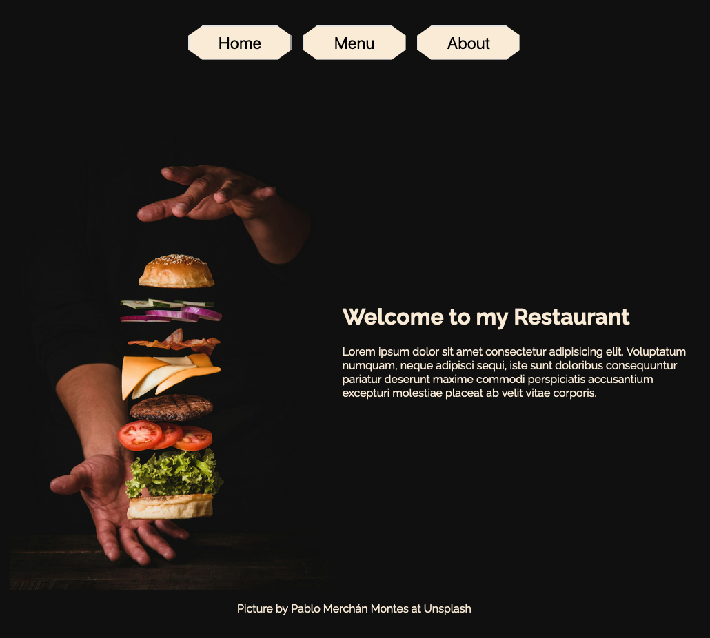
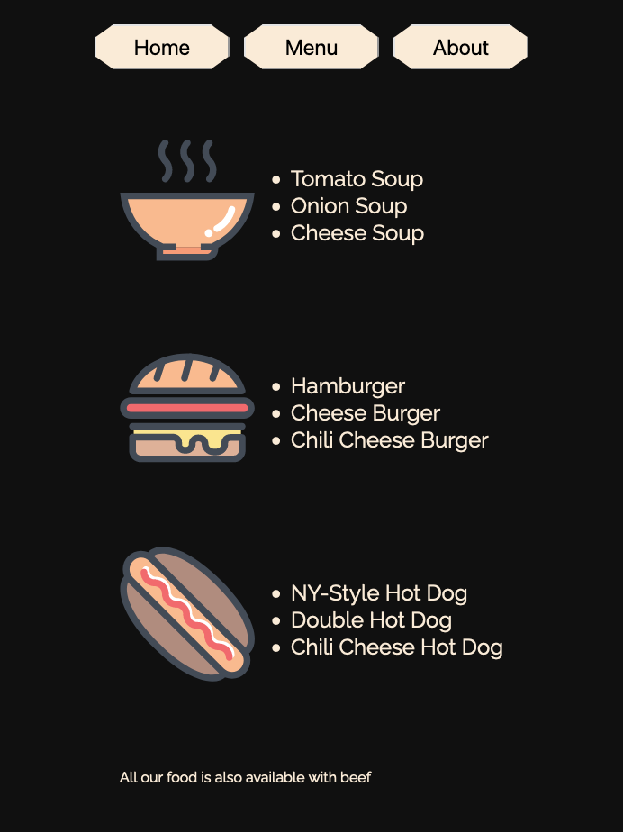
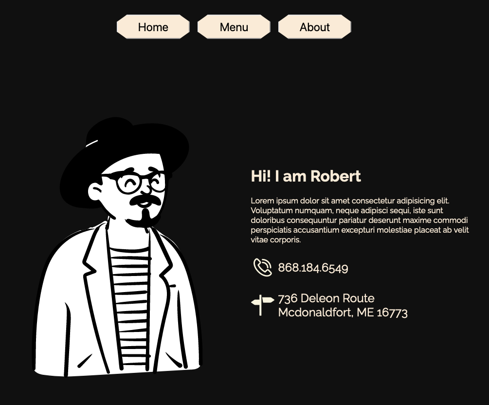

# Restaurant Page Project

This is a simple restaurant page project built using HTML, CSS, and JavaScript. The project is aimed at showcasing the use of webpack as a module bundler.

## Technologies Used

The following technologies were used in this project:

     &nbsp;
     &nbsp;
     &nbsp;
     &nbsp;

 
<ul>
    <li> HTML: Used for structuring the web page.
    <li> CSS: Utilized for styling the elements and layout of the page.
    <li> JavaScript: Implemented for interactivity and dynamic content.
    <li> Webpack: Employed as a module bundler to manage project dependencies and optimize assets.
</ul>

## Project Overview

The restaurant page project consists of the following key features:

- **Homepage**: Displays information about the restaurant, such as its name, location, menu, and contact details.
- **Code-Structure**: The website is completely rendered in JavaScript. Each subpage is located in an own JavaScript module
- **Bundler**: My first project using a bundler to bundle the code

## Some Pictures

    
    
    

